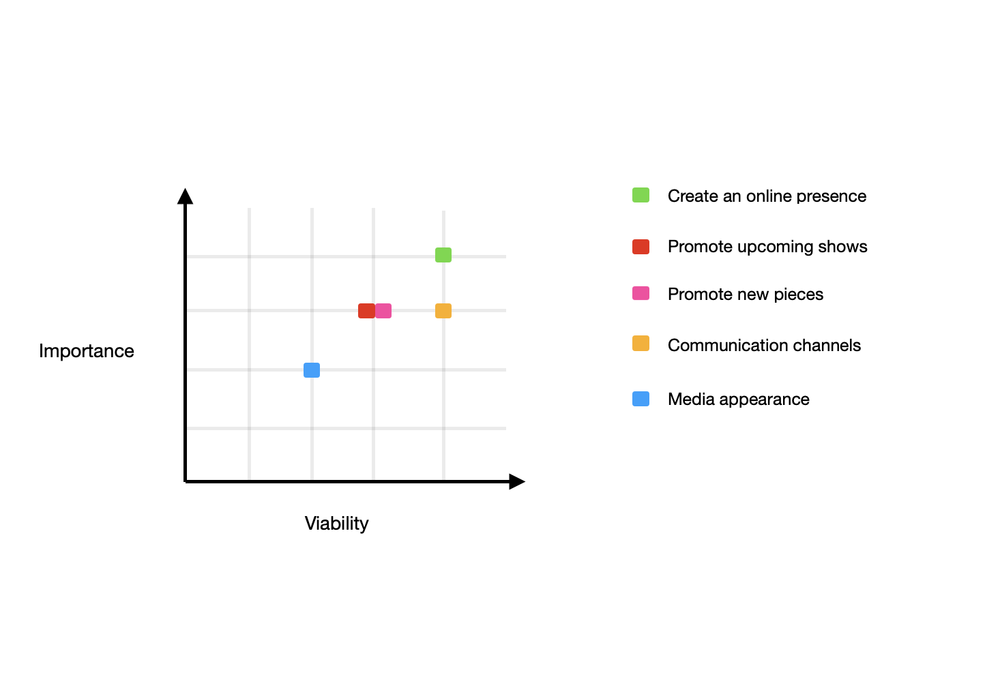

# Genesis 37

## Introduction

This website was created for a theatre company named Genome to showcase their theatre piece Genesis 37. It focus on providing excisting and new fans to find the relevant information about upcoming events, Genesis 37's goals and to get to know the creators. 

Genesis 37 was created during lockdown by former University students Amalia and Argy. With their final theatre project being moved from the classroom to Zoom online they took the opportunity to continue the project further and get more people involved in a virtual theatre experience. The purpose of this website is to continue their goal to make virtual theatre the new normal and to show that theatre is not dead because of Covid-19 that has stopped the live theatre for the time beeing. 

This is the first project out of the four Milestone Projects to be completed in Full Stack Web Development Program at Code Institute. 
***

## UX

### User Demographic
#### Ideal users of the website:
- Current fans
- Potential fans
- Media
- Future bookers (companies, schools etc)

### User Stories
#### Current Fans goals:
- As a current fan, I want to find out about upcoming events to be able to take part of it.
- As a current fan, I want to find out about any new theatre pieces coming.

#### Potential/New Fans goals:
- As a new fan, I want to learn about the company and its founders in order to better understand their purpose. 
- As a new fan, I want to navigate through the website effortlessly to find relevant content. 
- As a new fan, I want to find relevant social media links to keep updated on relevant news.
- As a new fan, I want to see relevant content to better understand their work. 

#### Potential Bookers goals:
- As a potential booker, I want to effortlessly navigate through the theatre companys website to find relevant information for making a booking. 

### Development Planes

To create a well informed and structured webside, the developer worked with one of the founders to work out content of the website to reach the user stories goals. 

#### Strategy

The website will target the following audience:

 **People:**
 - Current fans
 - New fans
 - Potential bookers
 

 **Demgraphic:**
 - 16 years olds and up
 - Student ages 16 and up
 - Corparate companies
 - Theaters

 **Attributes:**
 - Being curious
 - Positive for change
 - Value of a more open lifestyle
 - Lifestyle of being a fan of theatre

Genesis 37 website needs to make the users able to:
- Find necessary information about the company
- Upcoming shows
- New theatre pieces
- Contact information (social media and booking enquires)

Genesis 37 website needs to make the company be able to:
- Easily present users of information about the company and keep them updated on new pieces and upcoming events
- Easily present their social media accounts to the users
- Easily allow users to communicate with them
- Easily allow the company to present themself in an intriguing way to the users

A strategy diagram was created by following these goals in mind to find the trade off between importance and viability:

#### Scope
With the strategy defined we need to determine what needs to be done according to the strategy plan. 

**What the website need to feature:**
- Bio about the company 
- Bio about the founders
- Insight about the shows
- Upcoming shows
- New theatre pieces
- Social media links
- Contact details
- Gallery features (pictures)

**What functionalities the website need to have:**
- The user will be able to easily navigate the website
- The user will be able to easily find external links in order to book tickets, find upcoming shows/ events
- The user will be able to easily contact Genome theatre company throught social media and other choosen communication channels

